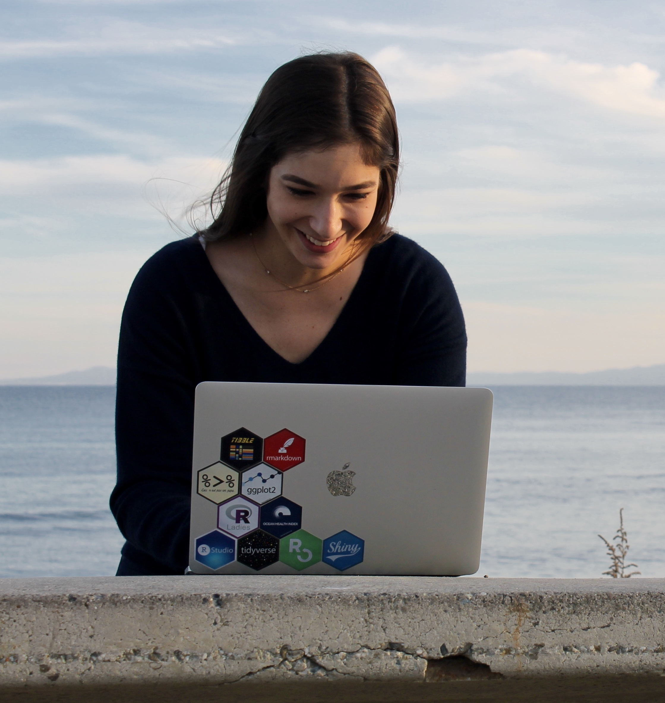
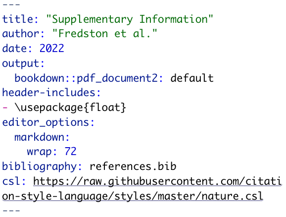
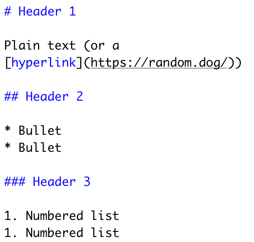
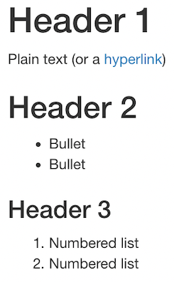

```{r setup, include=FALSE}
options(htmltools.dir.version = FALSE)
knitr::opts_chunk$set(
  fig.retina=3,
  out.width = "100%",
  cache = FALSE,
  echo = TRUE,
  message = FALSE, 
  warning = FALSE,
  hiline = TRUE,
  fig.showtext = TRUE
)

library(palmerpenguins)
library(tidyverse)
```

```{r xaringan-themer, include=FALSE, warning=FALSE}
library(xaringanthemer)

dark_yellow <- "#EFBE43"
light_yellow <- "#FDF7E9"
gray <- "#333333"
blue <- "#4466B0" 

style_duo(
    # colors
 
  primary_color = light_yellow,
  secondary_color = "#EBB59F",
  header_color = gray,
  text_color = gray,
  code_inline_color = colorspace::lighten(gray),
  text_bold_color = colorspace::lighten(gray),
  link_color = "#186118",
  title_slide_text_color = "#186118",

          # fonts
          header_font_google = google_font("Permanent Marker"),
          text_font_google = google_font("Lato"),
          code_font_google = google_font("Fira Mono"))
```

class: inverse center middle

# Welcome!

--

I'm glad you're here.

---

# Why am I here? 

### To learn (or learn more about) markdown

A beautiful, flexible language for formatting plain text — into a website, a PDF, a slide deck (like this one!), a book, a report, or just legible code. 

---

# Who is this for? 

Anyone who wants to improve the way that you format and share your work — whatever that means to you. 

---

# Alexa Fredston

.pull-left[
- Postdoctoral associate, Rutgers University, New Jersey, USA
- Quantitative marine ecologist 
- Treasurer of SORTEE
- Inclusive teaching of coding, etc. 
- afredston on [Twitter](https://twitter.com/AFredston) and [GitHub](https://github.com/afredston)
]

.pull-right[

]

--- 

# Outline

1. Introduction
1. Documents
1. Code 
1. Slides 

---

# What is Markdown?

- A language for formatting text with a plain text editor 
- Designed to be readable in its raw form
- Similar to LaTeX, but more “lightweight” and better integrated with analyses 
- Language agnostic; .md files can be opened by most code editors 
  - We will be editing .Rmd files from RStudio today, but that doesn't actually require any R knowledge! 
  
---

# What does this have to do with open science?

Using Markdown to generate publications, reports, websites, etc. will:
* Make dynamically updating them with new results easier
* Reduce errors from manually entering results 
* Create new venues for science communication

Using Markdown to organize your code will:
* Allow you to organize and annotate your analyses 
* Make it easier for others to tell what you did, aiding reproducibility  
  
---

# Cool Markdown examples

An entire scientific manuscript [marine protected areas](https://github.com/DanOvando/population-effects-of-mpas) or [matrix population models](https://github.com/BruceKendall/MPM-errors)

A [dynamically updating CV](http://nickstrayer.me/datadrivencv/)

A [RMarkdown tutorial ... written in RMarkdown](https://allisonhorst.github.io/udm-rmarkdown/) 🤯 

A [website collaboratively authored in RMarkdown](https://thefaylab.github.io/lab-manual)

An [entire course](https://damariszurell.github.io/CLEWS-EDB/)


---

# Today's learning objectives

By the end of this tutorial, I expect that you will be able to:
* Understand the different parts of a Markdown file
* Recognize how the formatting of raw text in Markdown translates to the aesthetics of an output file
* Generate basic PDFs and slides with code output 
* Understand how Markdown can facilitate open science goals
* Know where to go to get help or learn more 

---

# The architecture of Markdown

### 1. YAML header
### 2. Markdown text
### 3. Code chunks 

---

## 1. YAML header 

.pull-left[
- Its own language (not markdown!)
- New markdown files in R include it by default
- Modify it to change some global document options (custom formatting)
- Mostly going to ignore it today
]

.pull-right[

]

---

## 2. Markdown text

.pull-left[
rmarkdown

]

.pull-right[ 
html 


]

---

## 3. Code chunks

```{r demo-intro, fig.height=2.5, fig.retina=3}
ggplot(aes(x=body_mass_g, y=flipper_length_mm), data=penguins) +
  geom_point() +
  theme_xaringan() + labs(x="Body mass, mm", y="Flipper length, g")
```

---
class: inverse center middle

# Let's get started

---

# Setup

Software you will need: 
- RStudio

Packages you will need installed:
- `rmarkdown`
- `palmerpenguins`
- `tidyverse`
- `leaflet` (not crucial if you don't want to install it)

Run `install.packages("packagename")` for any of these that you need to. 

Take five minutes to do all this, and let me know if you have issues. 

Throughout this workshop, you can get help by raising your hand or using the chat. 

---

# Get the code!

This unavoidably involves a little bit of exposure to GitHub. 

1. Go to [https://github.com/afredston/markdown-sortee](https://github.com/afredston/markdown-sortee) (I will also put this link in the chat)
1. Click the green "Code ▾" button and then download ZIP (unless you are comfortable enough with GitHub to clone the repository; in that case, go for it)
1. Open RStudio and then navigate to the contents of the ZIP

---
class: inverse center middle

# Documents

---

# Authoring documents

1. Open `document.Rmd` in RStudio
1. Click "knit" at the top of RStudio (if you don't see it, be sure rmarkdown is installed, and relaunch RStudio)
1. Marvel at the glory of what you've created
1. Look line by line between the .pdf and the .Rmd documents. (The PDF will also appear in the `markdown-sortee` folder that `document.Rmd` is in, if you have trouble finding it.)
1. Change something in the document! Here are some ideas:
  + Edit the title, author, or date
  + Write some new text, and try formatting it (make it bold, a header, a bullet...)
  + Change the embedded photo
1. If you're familiar with these Markdown basics, try something more advanced (and any of you can do this with Google's help!)
  + Change the color of some text
  + Insert a table 
  + Add an in-text reference to the photo
  + Try aligning text to the center or right, or the image to the left or right

I'll give you five minutes to explore this and troubleshoot as needed. Then we'll check in, and hopefully some of you will share what you discovered. Then I'll bring the document up on my computer and give you a tour. 

---

# Authoring documents

One fairly new feature (and one reason we're using RStudio today!) is their new [visual markdown editor](https://rstudio.github.io/visual-markdown-editing/). It's basically an ultra powerful hybrid of Markdown and Microsoft Word. But be warned, it's a little buggy if you frequently switch editing modes. 

People write whole books in Markdown, and this may make that seem a little more achievable. For example, the new visual editor allows [easy citation management with a Zotero library](https://www.rstudio.com/blog/rstudio-1-4-preview-citations/) (if we have time, I'll show you this on my computer). 

---

# Authoring documents

### What's the catch?

Much like the transition from Excel to code, some simple things are much faster in Markdown (changing the font throughout your document), and others are much more annoying (sizing and aligning images). 

In my experience, Markdown is worth it for scientists because of its enormous advantage over a word processor: **code integration**. 

---
class: inverse center middle

# Code

---

# Why code in Markdown?

* Can render text and code outputs in the same document
* Can annotate and organize your code more legibly 
* Don't actually need to do anything different to your code
* Can use multiple programming languages in the same script (although I generally suggest [Jupyter](https://jupyter.org/) instead for this)
```{r, echo=FALSE}
names(knitr::knit_engines$get())
```

---

# Writing code with RMarkdown

1. Open `code.Rmd`. 
1. Read through the document and run the chunks one at a time. 
1. Try any of the following:
  - Create a new chunk that generates a different figure
  - Add some chunk options to the header to control how the figure is printed; for example, `fig.cap="Caption here"` or `fig.width=5` or `results="hide"`. See [https://yihui.org/knitr/options/](https://yihui.org/knitr/options/) for details
  - Put in new coordinates to the map chunk to map someplace you know
  - Click "knit" at the top of the page and see what happens!
  - If there is anything you want formatted differently in the html file output, try to fix it (hint: you might start with the chunk options for the first chunk, `setup`)
1. If R isn't your language, feel free to explore these same options in Jupyter.

---

class: inverse center middle

# Slides

---

# Creating presentations with RMarkdown

The principles are the same as you've learned — text formatted in Markdown, code chunks, embedded links / images / references / etc. 

The only big difference to remember is that slides are split from one another by:

`---`

Creating presentations in RMarkdown will often force you to deal with extra formatting challenges (image sizes, etc)

The best way to learn is just to try it! 

---

# Creating presentations with RMarkdown

This is a great time to learn how to create *new* .md or .Rmd files — up to now, you've been using ones I created. Take a few minutes to try the following. 

To create a new `.Rmd` from RStudio, click file -> new file -> RMarkdown and click "Presentation". I suggest you use ioslides or Slidy, unless you know you have TeX installed, in which case beamer works too.

Now... you have all the skills to create this presentation! Try:
* Adding a title slide (use headers)
* Inserting a plot 
* Making lists 

Try knitting it along the way to see how it looks.

Feel free to copy-paste code from `code.Rmd` and `document.Rmd`. Save this new file as `presentation.Rmd`. 

---

# Xaringan

I make my slides using [xaringan](https://bookdown.org/yihui/rmarkdown/xaringan.html), which I encourage you to install and explore. It's easy to make beautiful and unique presentations with minimal coding, especially with the help of [xaringanthemer](https://pkg.garrickadenbuie.com/xaringanthemer/). 

It has lots of other cool features — for example, xaringan's "infinite moon reader" (`xaringan::inf_mr()`) lets you view the rendered output as you type.

---

# We're almost done!

## Any questions before I wrap up? 

---

# A horizon scan: Quarto

[Quarto](https://quarto.org/) is a sequel to RMarkdown developed by RStudio. 

While they are still maintaining RMarkdown, a lot of new development will probably happen in Quarto.

The differences between RMarkdown and Quarto are not huge for R users ([overview here](https://yihui.org/en/2022/04/quarto-r-markdown/)), and there is much more RMarkdown documentation available, which is why I taught it today. 

I encourage you to keep tabs on Quarto's development and try it out, especially if you're not an R user. 

---
# Thank you for your participation 

.pull-left[
### My sources and inspiration
- [Yihui Xie's extraordinary RMarkdown guide](https://bookdown.org/yihui/rmarkdown/)
- [Allison Horst's rmarkdown tutorial](https://allisonhorst.github.io/udm-rmarkdown/)

### How to contact me
- Email fredston@rutgers.edu 
- afredston on [Twitter](https://twitter.com/AFredston) and [GitHub](https://github.com/afredston)
- [alexafredston.com](https://www.alexafredston.com/)

]

.pull-right[
### Additional resources
- [Yihui Xie's hilarious, whirlwind video tour of RMarkdown](https://www.youtube.com/watch?v=qLEkUjxk7e8)
- [A Xaringan slides tutorial video](https://presentable-user2021.netlify.app/)
- [Alison Hill and Desirée De Leon's overview of publishing .Rmds to websites](https://rstudio-education.github.io/sharing-short-notice/#1)
- [Alison Hill's advanced RMarkdown workshop](https://www.apreshill.com/project/advanced-r-markdown/)
]

---
